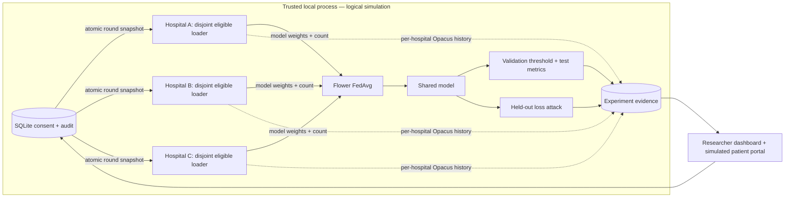

# Architecture

The implemented stack is Python 3.11/PyTorch, Flower FedAvg, Opacus, MedMNIST/scikit-learn, FastAPI/SQLAlchemy/SQLite and React/Vite/TypeScript. Dependency versions are locked.

`federation/data.py` loads official PneumoniaMNIST splits and creates seeded, disjoint, label-biased training partitions, capped at 256 records per hospital for the demo. The official validation split selects each model's classification threshold; the official test split is evaluation-only.

`federation/experiment.py` trains local baselines with the same total epoch budget as federation. Before every federated round it snapshots scoped consent for each hospital. Eligible subsets feed local training and optional Opacus DP-SGD. Each hospital keeps one RDP accountant throughout the run, including across consent changes. Flower's pinned Message API/FedAvg aggregates model arrays weighted by eligible cohort size. Empty hospitals are skipped; fewer than two eligible hospitals stops the run with a failure status.

`backend/store.py` persists consent, audit events, configuration and measured run metadata in SQLite. `backend/app.py` exposes validated APIs and a single background training worker. The built frontend is served by the same process; Vite development origins are explicitly allowed. Host validation restricts the local demo. Role selection is not authorization: anyone who can access this server can inspect/change simulated consent.

`frontend/src/main.tsx` provides researcher experiments, hospital counts, metrics, privacy comparison and simulated patient consent/receipts. Responsive research, privacy and patient views use a restrained teal workspace theme, native controls and accessible result tables.

Hospital boundaries are logical within one trusted process, not network/process isolation. Flower messages contain model arrays and counts, not images. The coordinator can access all process memory and stores synthetic eligibility IDs; no independent residency or cryptographic audit attestation exists. DP receipts record eligibility rather than individual sampling events.

Model weights and result JSON are local artifacts; consent and results survive server restarts. Cached tensors reload on startup; first use still requires initialization. Run one process and one experiment at a time; no distributed queue or deployment infrastructure is included.

## Implemented data flow

All public image tensors are accessible to this local process; the diagram does not imply physical isolation. Attack evaluation uses label-matched unused training records and a disjoint calibration split. No image enters the API or Flower messages. Receipt exports describe both included and excluded round snapshots.

Submission preparation uses a separate database and saves four comparable runs, a two-round withdrawal proof, model artifacts and a standalone offline HTML/JSON backup. Server startup reloads cached tensors and marks interrupted experiments failed. A request Origin check also rejects foreign browser mutations.
